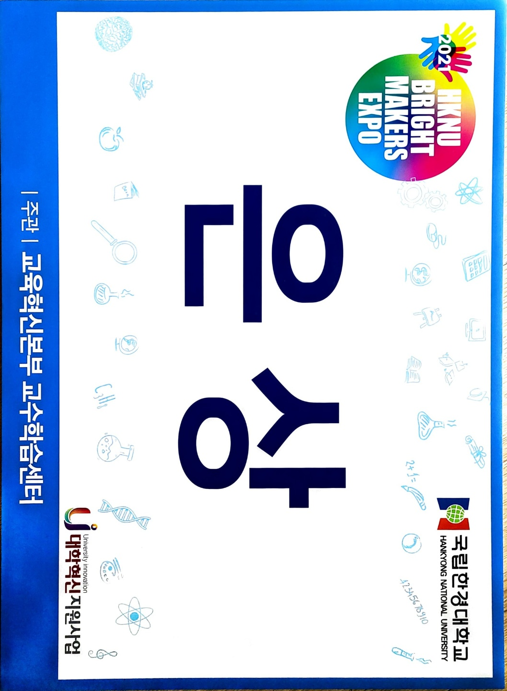

# discord-bot

혐오발언 탐지 모델 활용 사례

## 수상



한경대학교 Bright Makers Expo에서 은상을 받았습니다.

## 사용 방법

`.env` 파일 작성

```sh
cp .env.example .env
vim .env
```

`docker-compose`를 이용해 실행

```sh
docker-compose up -d
```
